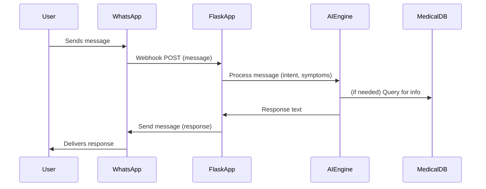

# AI-Powered Healthcare WhatsApp Chatbot

## Overview
A world-class, AI-powered healthcare chatbot that interacts with users via WhatsApp, providing medical Q&A, symptom checking, and triage, powered by advanced AI models. Built with Flask for the backend and designed for scalability, security, and compliance.

---

## Project Structure

```
healthpal/
│
├── app.py                  # Main Flask app (API endpoints, WhatsApp webhook)
├── ai/
│   ├── __init__.py
│   ├── nlp_engine.py       # AI/NLP logic (intent detection, symptom checker, etc.)
│   └── medical_qa.py       # Medical Q&A logic (LLM integration, retrieval, etc.)
├── services/
│   ├── __init__.py
│   ├── whatsapp.py         # WhatsApp API integration
│   └── user_profile.py     # User profile management, history, etc.
├── models/
│   ├── __init__.py
│   └── user.py             # User data models (SQLAlchemy or Pydantic)
├── static/
│   └── ...                 # Frontend assets (if admin panel needed)
├── templates/
│   └── ...                 # Jinja2 templates (for admin panel)
├── requirements.txt
├── README.md
└── config.py               # Configuration (env vars, secrets, etc.)
```

---

## Key Features & Components

### Backend (Flask, AI, WhatsApp)
- **Webhook Endpoint:** Receives WhatsApp messages.
- **AI/NLP Engine:** Processes messages, detects intent, extracts symptoms, answers medical questions (using LLMs like GPT-4, MedPaLM, or open-source models).
- **Medical Knowledge Base:** For symptom checking, triage, and FAQ (integrate with trusted sources).
- **User Profile & History:** Store user interactions, medical history, preferences (with privacy compliance).
- **WhatsApp API Integration:** Send/receive messages, handle media, templates, etc.
- **Admin/Monitoring API:** For analytics, logs, and manual intervention if needed.

### Frontend (Optional, for Admin/Monitoring)
- **Dashboard:** View conversations, analytics, user stats.
- **Conversation Viewer:** See chat history, flag issues.
- **Settings:** Manage API keys, AI model configs, etc.
- **Modern UI:** Responsive, accessible, beautiful (React, Vue, or Flask+Bootstrap).

---

## Development Steps

### A. Backend Development
1. **Set Up Flask App Structure** (as above).
2. **Implement WhatsApp Webhook** (already started in your `app.py`).
3. **Build WhatsApp Service Layer** (`services/whatsapp.py`):
   - Encapsulate all WhatsApp API logic.
   - Handle retries, error logging, media, templates.
4. **Develop AI/NLP Engine** (`ai/nlp_engine.py`):
   - Integrate with LLM (OpenAI, Google, or local model).
   - Add intent detection, symptom extraction, triage logic.
   - Use medical ontologies (SNOMED, ICD-10) for accuracy.
5. **Medical Q&A Module** (`ai/medical_qa.py`):
   - Use retrieval-augmented generation (RAG) for up-to-date answers.
   - Integrate with trusted medical APIs (Mayo Clinic, MedlinePlus).
6. **User Profile Management** (`services/user_profile.py`, `models/user.py`):
   - Store user data securely (consider SQLite, PostgreSQL, or MongoDB).
   - Ensure GDPR/HIPAA compliance.
7. **Admin/Monitoring Endpoints**:
   - For logs, analytics, manual overrides.

### B. Frontend Development (Admin/Monitoring)
1. **Design Modern Dashboard** (React, Vue, or Flask+Bootstrap).
2. **Implement Real-Time Conversation Viewer** (WebSocket or polling).
3. **Add Analytics & Settings Pages**.
4. **Ensure Responsive, Accessible UI**.

### C. Security & Compliance
- Use HTTPS, secure webhooks, validate all inputs.
- Store secrets in environment variables (`config.py`).
- Log access, errors, and monitor for abuse.
- Ensure privacy compliance (GDPR, HIPAA).

### D. Testing & Deployment
- Write unit/integration tests (pytest, unittest).
- Use Docker for containerization.
- Deploy on scalable cloud (AWS, GCP, Azure, or Heroku).
- Set up CI/CD pipeline.

---

## AI Integration: Best Practices

- **Model Selection:** Use the best available LLM for healthcare (OpenAI GPT-4, MedPaLM, or custom fine-tuned model).
- **Prompt Engineering:** Carefully craft prompts for safety, accuracy, and empathy.
- **Fallbacks:** If AI is unsure, escalate to human or provide safe, general advice.
- **Continuous Learning:** Log anonymized queries for model improvement.

---

## Sample Flow Diagram



---

## Getting Started

### Prerequisites
- Python 3.8+
- Flask
- requests
- WhatsApp Business API credentials
- (Optional) OpenAI/Google API keys for LLM

### Installation
1. Clone the repository:
   ```bash
   git clone <repo-url>
   cd healthpal
   ```
2. Install dependencies:
   ```bash
   pip install -r requirements.txt
   ```
3. Set up environment variables in `config.py` or using `.env`:
   - WhatsApp API credentials
   - AI/LLM API keys
   - Flask secret key
4. Run the Flask app:
   ```bash
   python app.py
   ```

### Deployment
- Use Docker for containerization.
- Deploy on cloud platforms (AWS, GCP, Azure, Heroku).
- Set up HTTPS and secure webhooks.

---

## Security & Compliance
- All user data is handled securely and in compliance with GDPR/HIPAA.
- Secrets and API keys are never hardcoded; use environment variables.
- All endpoints are validated and sanitized.

---

## Contributing
Pull requests are welcome! For major changes, please open an issue first to discuss what you would like to change.

---

## License
